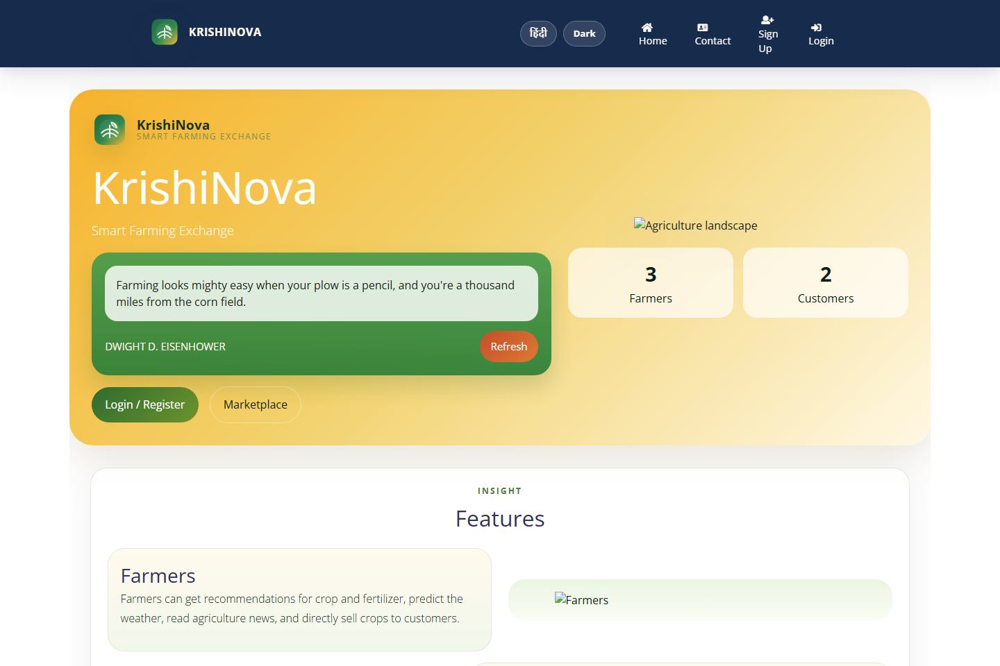
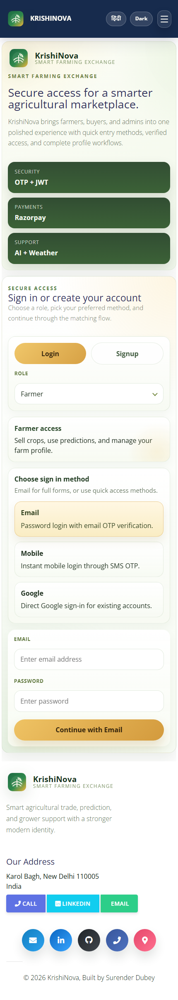
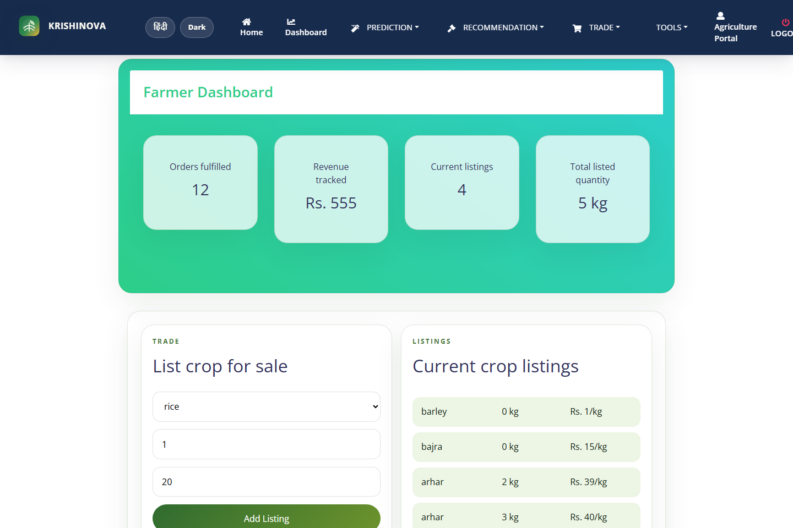
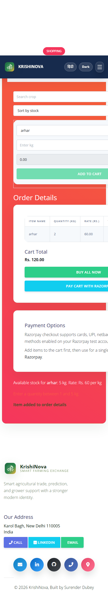
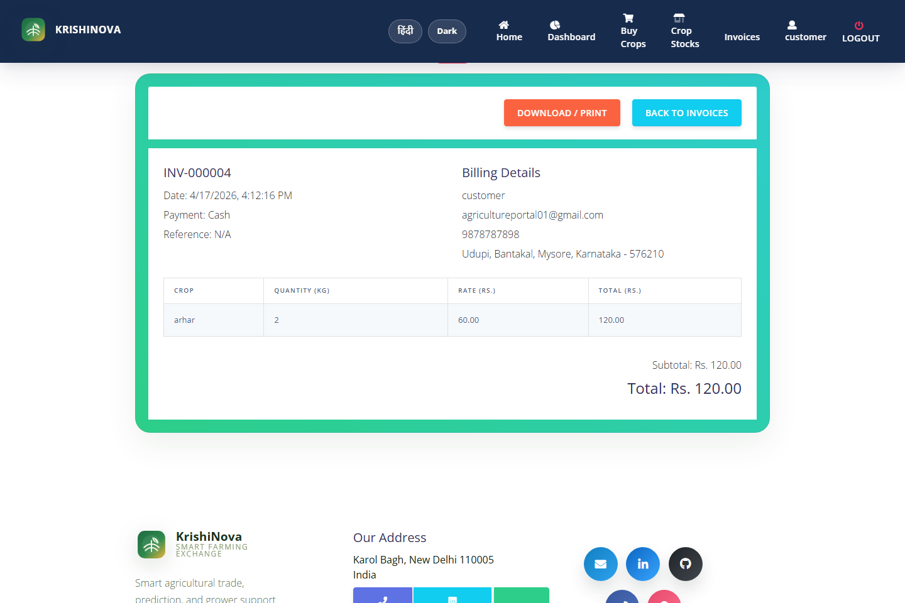

# KrishiNova


KrishiNova is a full-stack smart agriculture marketplace built for farmers, customers, and administrators. It combines crop advisory tools, marketplace workflows, payments, invoices, live weather, news, and AI-assisted support in one responsive web platform.

The project is designed as a product-style application with separate role-based experiences, cloud-ready deployment, and real SQL-backed workflows.

## Live Demo

- Frontend: [krishi-nova-six.vercel.app](https://krishi-nova-six.vercel.app)
- Backend API: [krishinova.onrender.com](https://krishinova.onrender.com/api/health)
- Repository: [github.com/Surenderdubeyofficial/KrishiNova](https://github.com/Surenderdubeyofficial/KrishiNova)

## Highlights

- Multi-role platform for `Farmer`, `Customer`, and `Admin`
- Responsive UI across desktop and mobile
- Email OTP, phone OTP, Google sign-in, and JWT-based authentication
- Crop marketplace with listing, stock visibility, checkout, and invoice history
- Razorpay payment integration
- Agriculture-focused AI and ML tools
- Live weather forecasting and agriculture news
- Hindi / English language toggle
- Light / Dark theme toggle

## Core Features

### Farmer Experience

- Farmer dashboard with sales and listing overview
- Crop trade listing flow
- Crop stock visibility
- Selling history
- Crop prediction
- Crop recommendation
- Fertilizer recommendation
- Rainfall prediction
- Yield prediction
- Weather forecast
- News feed
- AI chatbot support

### Customer Experience

- Customer dashboard
- Crop marketplace browsing
- Buy crops flow
- Cart and checkout
- Razorpay payment option
- Invoice generation and invoice history
- Profile management

### Admin Experience

- Admin dashboard with platform overview
- Farmer management
- Customer management
- Contact message management
- Crop stock and activity visibility

## Technology Stack

### Frontend

- React
- Vite
- React Router

### Backend

- Node.js
- Express.js
- JWT authentication
- Nodemailer
- Twilio
- Google OAuth verification

### Database

- MySQL
- `mysql2`

### Payments and Integrations

- Razorpay
- Stripe support scaffold
- OpenWeather API
- News API
- Gemini AI with fallback handling

### AI / ML Layer

- Python-based agriculture prediction scripts
- Crop prediction
- Crop recommendation
- Fertilizer recommendation
- Rainfall prediction
- Yield prediction

## Screenshots

### Home Page



### Authentication Experience



### Farmer Dashboard



### Customer Marketplace Flow



### Invoice View



## Project Structure

```text
KrishiNova/
├── frontend/                 # React + Vite client
├── backend/                  # Express API
├── shared/
│   ├── db/                   # SQL schema and seed data
│   └── ML/                   # Python ML scripts and model assets
├── DEPLOYMENT.md             # Production deployment guide
└── render.yaml               # Render deployment blueprint
```

## Local Development

### 1. Clone the repository

```bash
git clone https://github.com/Surenderdubeyofficial/KrishiNova.git
cd KrishiNova
```

### 2. Install dependencies

```bash
npm install
npm run install:all
```

### 3. Configure the database

Create a MySQL database and import:

```text
shared/db/agriculture_portal.sql
```

### 4. Configure environment files

Create and update:

- `backend/.env`
- `frontend/.env`

Useful templates are included here:

- `backend/.env.example`
- `backend/.env.render.example`
- `frontend/.env.example`
- `frontend/.env.vercel.example`

### 5. Start the app

```bash
npm run dev
```

Default local URLs:

- Frontend: `http://localhost:5173`
- Backend: `http://localhost:5000`

## Important Environment Variables

### Backend

- `DB_HOST`
- `DB_PORT`
- `DB_NAME`
- `DB_USER`
- `DB_PASSWORD`
- `JWT_SECRET`
- `SMTP_*`
- `TWILIO_*`
- `GOOGLE_CLIENT_ID`
- `GEMINI_API_KEY`
- `OPENWEATHER_API_KEY`
- `NEWS_API_KEY`
- `RAZORPAY_KEY_ID`
- `RAZORPAY_KEY_SECRET`

### Frontend

- `VITE_API_URL`
- `VITE_GOOGLE_CLIENT_ID`

## Deployment

KrishiNova is prepared for cloud deployment with:

- Frontend on Vercel
- Backend on Render
- MySQL database on Railway

See the full deployment guide in:

- [DEPLOYMENT.md](C:/Users/hp/Downloads/agriculture-portal-mern-sql/DEPLOYMENT.md)

## Production Notes

- Rotate all secrets before public launch
- Use a dedicated production database user instead of local root access
- Publish or properly configure Google OAuth origins before enabling public Google sign-in
- Twilio trial accounts only send OTP to verified numbers; upgrade to enable public SMS OTP usage
- Razorpay test keys should be replaced with live keys before production payments

## Scripts

### Root

```bash
npm run dev
npm run build
npm run start
```

### Frontend

```bash
npm run dev --prefix frontend
npm run build --prefix frontend
```

### Backend

```bash
npm run dev --prefix backend
npm run start --prefix backend
```

## Use Cases

KrishiNova is suitable as a showcase project for:

- Full-stack product development
- Multi-role dashboard systems
- SQL-backed marketplace platforms
- Payment and invoice workflows
- AI/ML integration in web products
- Cloud deployment with separate frontend, backend, and database services

## Author

**Surender Dubey**

- GitHub: [Surenderdubeyofficial](https://github.com/Surenderdubeyofficial)
- LinkedIn: [surenderdubey](https://www.linkedin.com/in/surenderdubey/)

## License

This project is shared for learning, portfolio, and demonstration purposes.
